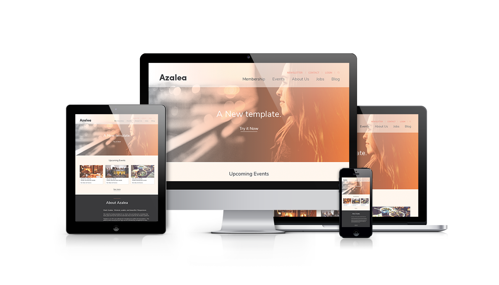

# Azalea Theme
This repository includes the necessary html templates and css that were used in the Azalea Theme.

## Getting Started
If your running Tendenci on your own local machine, feel free to clone or fork the repo.
To make changes from Tendenci's browser-based Theme Editor, you can copy and paste templates.  Please note that css changes currently on your site may affect the css in this template.

## Theme Structure
This theme includes templates in only the following modules:
* Events
* News
* Forms
* Jobs
* Articles
* Accounts Login

Check out the [Willow Theme](https://github.com/tendenci/tendenci-base-theme) for a more comprehensive template set!

Azalea has a large, graphic header in each of the modules which relies on a default template.  In order to make an update, please be sure to include the default-xxx.html template as well as the template in the associated module folder.  Why did we do it this way?  The image from that default template can be carried throughout the module.

The custom.css file contains the styling information for this theme.  Be sure to include this css in your updates.

## Boxes Content
The Azalea theme does utilize a few boxes to provide editable content particularly in the header and footer.  You can check out the Boxes folder for this content to get started manually!  Or you can use our boxes fixtures located in the apps folder!

* Box 01 - Header Logo
* Box 02 - Homepage About Us Text (Right)
* Box 03 - Homepage About Us Image (Left)
* Box 04 - Footer

Note: The content of the boxes will show up in your theme editor, they are benign, you can delete them if you choose.  They are included for those who don't want to use or have trouble using fixtures to migrate the boxes data. 

## Fonts
The fonts in this theme are:
* 'Amiri', serif
* 'Nunito Sans', sans-serif

They are integrated into base.html using Google Fonts CDN.  If you'd like to host the fonts yourself, you can by downloading them at [Google Fonts](https://fonts.google.com).

## Creator
This template was created by [Tendenci](https://tendenci.com)!

* [Twitter](https://twitter.com/tendenci)
* [Facebook](https://facebook.com/tendenci)
* [YouTube](https://youtube.com/tendencicms)
* [Github](https://github.com/tendenci)

## Bugs and Issues
Having an issue with this template?  Please submit here on [Tendenci's Azalea Theme Github](https://github.com/tendenci/azalea-theme/issues).

## Copyright and License
Copyright Tendenci — The Open Source AMS, 2017 under the GPU license.

Images are from [Pexels](https://pexels.com) under CC0.
Fonts are from [Google Fonts](https//fonts.google.com).
